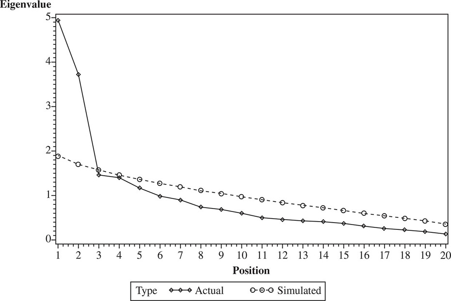

# Factor Analysis Dashboard `R ` `Shiny` App

A `R` `Shiny` app that does a set of assumptions for Factor and Principal Component Analysis. Tests for Kaiser-Meyer-Olkin (KMO) in a dataset. It provides a final sample by removing variables in a iterable manner while keeping account of the variables that were removed in each step.

It is made to input a square matrix `ma2` raw file from `BibExcel` withou *any* modification. The app has 4 tabs:

1. **Raw Data**: raw data from the `ma2` square matrix
2. **KMO Removed**: list of the variables removed by having individual KMO $< 0,5$ 
3. **Scree Plot**: Scree plot based on *Cattell*'s Scree test  (Cattell, 1966)  but uses *parallel analysis*
4. **Rotated Factor/Component Table**: *varimax* rotated table of either factor or components (depending on which type was chosen)

## Installation

``` R
install.packages(c("psych", "ggplot2", "devtools", "shiny"))
devtools::install_github("storopoli/FactorAssumptions")
library(shiny)
runGitHub( "shiny-factor-analysis", "storopoli")
```

## What is KMO and Communalities?

*Factor Analysis* and *Principal Components Analysis* (PCA) have some
precautions and assumptions to be observed (Hair et al. (2018)).

The first one is the KMO (Kaiser-Meyer-Olkin) measure, which measures
the proportion of variance among the variables that can be derived from
the common variance, also called systematic variance. KMO is computed
between 0 and 1. Low values (close to 0) indicate that there are large
partial correlations in comparison to the sum of the correlations, that
is, there is a predominance of correlations of the variables that are
problematic for the factorial/principal component analysis. Hair et al.
(2018) suggest that individual KMOs smaller than 0.5 be removed from the
factorial/principal component analysis. Consequently, this removal
causes the overall KMO of the remaining variables of the
factor/principal component analysis to be greater than 0.5.

The second assumption of a valid factor or PCA analysis is the
communality of the rotated variables. The commonalities indicate the
common variance shared by factors/components with certain variables.
Greater communality indicated that a greater amount of variance in the
variable was extracted by the factorial/principal component solution.
For a better measurement of factorial/principal component analysis,
communalities should be 0.5 or greater (Hair et al. (2018)).

## Parallel Analysis

> Based on: DeVellis, R. F. (2017). *Scale development: Theory and Applications*(4th ed.). Chapel Hill: University of North Carolina.

***Parallel analysis*** is a statistical criterion that is gaining in popularity (e.g., Hayton, Allen, & Scarpello, 2004). The logic underlying this approach is that the magnitude of the eigenvalue for the last retained factor should exceed an eigenvalue obtained from random data under otherwise comparable conditions. In other words, in a real study involving the factor analysis of, say, 20 variables measured on 500 people, the eigenvalue of any retained factor should be greater than the corresponding eigenvalue obtained from randomly generated data arranged to represent 20 variables measured on 500 people. Parallel analysis routines, which are available on the Internet as user-developed macros for a variety of statistical packages, generate a large number of distributions of the size corresponding to the actual data set. Thus, in this example, the algorithm would generate many (the user can typically specify how many; 1,000 is often the default) random data sets of 20 variables and 500 subjects. Eigenvalues are extracted for each of these artificial data sets, and a distribution of the eigenvalues is created within the program for Factor I, Factor II, and so forth. For each of these distributions, a representative value (e.g., the median) is identified. Graphical output is displayed, as shown in the figure below. This figure has two lines connecting points corresponding to eigenvalues for successive factors. The more-or-less straight line descending gradually from left to right represents the median eigenvalues (across the numerous, computer-generated data sets) for essentially random data in which the variables are not related to common underlying factors. The other line in the figure is the actual scree plot, based on the real data in which one is interested. The number of factors to retain is indicated by where the tracings for actual and random data cross. The magnitudes of eigenvalues that lie above the line representing the random data are greater than would be expected by chance alone (i.e., they are statistically significant). Those below the random-data line are not significant (i.e., they can be expected to occur purely by chance). In the example shown in the accompanying figure, the first two factors from the actual data achieved eigenvalues greater than those for the corresponding factors based on the randomly generated data. Thus, only those first two factors meet the retention criterion.

A plot from parallel analysis showing magnitudes of eigenvalues



Because macros for conducting parallel analysis in various statistical packages (including SAS and SPSS) are readily available via the Internet without restrictions on their use and at no charge, applying this method as a means of selecting the number of factors to retain has become common practice. In my experience, the guidance it provides is consistent with the judgments I would make based on subjective criteria such as the scree plot. It has the advantage, however, of its grounding in a statistical criterion and, thus, has wider acceptability than subjective methods. **Accordingly, it is highly recommended using parallel analysis as the primary basis for determining how many items to extract.**

Note that, whereas principal components are computed from the original correlation matrix, common factors are computed from a reduced correlation matrix containing estimates that have been adjusted to remove error variance from the variables. **Parallel analysis has been extended to use with common factors, but as Timmermann and Lorenzo-Seva (2011) note, the number of eigenvalues for the real data that exceed those for the random data tends to be greater in the case of common factors than in principal components.** The logic of parallel analysis was developed with components in mind. Thus, in some instances, the number of factors parallel analysis indicates should be retained from common factors may be an overestimate of the true dimensionality of the data set.

Circumstances may arise when substantive considerations (such as the interpretability of resulting factors) support the retention of more or fewer factors than a method such as parallel analysis indicates. When this occurs, I suggest presenting the results of the method first used (e.g., parallel analysis) together with a rationale for deciding to depart from the guidance that method provides. If the substantive issues are compelling, there should be little difficulty in convincing readers and reviewers that an appropriate decision has been reached. On the other hand, if the arguments marshaled in support of ignoring the initial results are not persuasive, then dismissing those results may not be warranted.

# Author

Jose Eduardo Storopoli [e-mail](mailto:thestoropoli@gmail.com)

# Road Map

* **Communalities in dataframe**: Have to input it in the raw data

# References

Cattell, R. B. (1966). The screen test for the number of factors. Multivariate Behavioral Research, 1, 245–276.

Hair, Joseph F., William C. Black, Barry J. Babin, and Rolph E.
Anderson. 2018. *Multivariate Data Analysis*. 8th ed. Cengage Learning.

Hayton, J. C., Allen, D. G., & Scarpello, V. (2004). Factor retention decisions in exploratory factor analysis: A tutorial on parallel analysis. Organizational Research Methods, 7(2), 191–205.

Timmermann, M. E., & Lorenzo-Seva, U. (2011). Dimensionality assessment of ordered polytomous items with parallel analysis. Psychological Methods, 16, 209–220.
